# Video Transcoding Service - AWS Service Linkage Diagram (Mermaid)

## Complete Service Relationship Diagram

```mermaid
graph TB
    %% External/Entry Points
    Users[End Users/Browsers]
    Internet((Internet))

    %% DNS & CDN Layer
    Route53[Route 53 DNS<br/>mytranscoder.cab432.com]
    CloudFront[CloudFront Distribution<br/>E3GZJLFEX8HAKT<br/>Cache: 70-80% hit rate]
    ACM[AWS Certificate Manager<br/>Cert: 3ebfd9d6<br/>TLS 1.2+]

    %% Load Balancing
    ALB[Application Load Balancer<br/>HTTPS:443 → HTTP:3000]

    %% Compute Services
    EC2[EC2 Instance t3.micro<br/>API Server<br/>Express.js Node.js]
    ECS[ECS Fargate Cluster<br/>transcoding<br/>1-3 tasks, 0.25vCPU, 512MB]
    Lambda[Lambda Function<br/>n10992511-dlq-handler<br/>128MB, Node.js 22.x]

    %% IAM Roles
    IAM_EC2[IAM Instance Profile<br/>VideoTranscoderEC2Role]
    IAM_ECS_Task[IAM Task Role<br/>ecsTaskRole-transcoding]
    IAM_ECS_Exec[IAM Execution Role<br/>ecsTaskExecutionRole]
    IAM_Lambda[IAM Execution Role<br/>CAB432-Lambda-Role]

    %% Storage Services
    S3_Original[S3 Bucket<br/>n10992511-videotranscoder-original<br/>AES-256, Versioning]
    S3_Processed[S3 Bucket<br/>n10992511-videotranscoder-processed<br/>AES-256, Versioning]
    S3_Frontend[S3 Bucket<br/>n10992511-mytranscoder-frontend<br/>HTML, JS, CSS]

    %% Database Services
    DDB_Users[DynamoDB Table<br/>videotranscoder-users<br/>5 RCU/WCU]
    DDB_Videos[DynamoDB Table<br/>videotranscoder-videos<br/>5 RCU/WCU<br/>UserIdIndex GSI]
    DDB_Jobs[DynamoDB Table<br/>videotranscoder-transcode-jobs<br/>5 RCU/WCU<br/>UserIdIndex, StatusIndex GSI]

    %% Queue Services
    SQS_Main[SQS Queue<br/>n10992511-transcode-jobs<br/>Max 3 retries<br/>Visibility timeout]
    SQS_DLQ[SQS Dead Letter Queue<br/>n10992511-transcode-dlq]

    %% Auth & Security
    Cognito[Amazon Cognito User Pool<br/>n10992511-videotranscoder<br/>MFA: TOTP/Email<br/>Groups: admin, user]
    Secrets[AWS Secrets Manager<br/>n10992511-cognito-config<br/>Cognito secret, Redis pwd]

    %% Cache & Config
    Redis[ElastiCache Redis 6.2<br/>cache.t3.micro<br/>Session + Job cache<br/>60-70% hit reduction]
    ParamStore[Systems Manager<br/>Parameter Store<br/>/n10992511/videotranscoder/dev/<br/>S3 buckets, DDB tables]

    %% Container Registry
    ECR[Amazon ECR<br/>n10992511-video-transcoding-service<br/>Worker image: Node + FFmpeg]

    %% Monitoring
    CloudWatch[Amazon CloudWatch<br/>Logs + Metrics<br/>ECS, Lambda, EC2 logs<br/>Auto-scaling alarms]

    %% VPC
    VPC[VPC<br/>vpc-007bab53289655834<br/>ap-southeast-2]

    %% Security Groups
    SG[Security Groups<br/>Restrictive rules<br/>Port 3000, 6379, 443]

    %% User Flow Connections
    Users -->|DNS lookup| Route53
    Route53 -->|Resolves to| CloudFront
    Users -->|HTTPS requests| CloudFront
    CloudFront -->|TLS termination| ACM
    CloudFront -->|Origin: Static assets| S3_Frontend
    CloudFront -->|Origin: API traffic| ALB
    ALB -->|SSL/TLS| ACM
    ALB -->|Forwards to| EC2

    %% VPC Relationships
    EC2 -.->|Resides in| VPC
    ECS -.->|Resides in| VPC
    Redis -.->|Resides in| VPC
    ALB -.->|Resides in| VPC
    EC2 -.->|Protected by| SG
    ECS -.->|Protected by| SG
    Redis -.->|Protected by| SG

    %% IAM Role Attachments
    EC2 ---|Assumes role| IAM_EC2
    ECS ---|Task role| IAM_ECS_Task
    ECS ---|Execution role| IAM_ECS_Exec
    Lambda ---|Assumes role| IAM_Lambda

    %% EC2 Service Connections (via IAM role)
    IAM_EC2 -->|s3:GetObject<br/>s3:PutObject<br/>GeneratePresignedUrl| S3_Original
    IAM_EC2 -->|s3:GetObject<br/>s3:PutObject<br/>GeneratePresignedUrl| S3_Processed
    IAM_EC2 -->|s3:GetObject| S3_Frontend
    IAM_EC2 -->|GetItem, PutItem<br/>UpdateItem, Query| DDB_Users
    IAM_EC2 -->|GetItem, PutItem<br/>UpdateItem, Query| DDB_Videos
    IAM_EC2 -->|GetItem, PutItem<br/>UpdateItem, Query| DDB_Jobs
    IAM_EC2 -->|SendMessage| SQS_Main
    IAM_EC2 -->|GetParameter| ParamStore
    IAM_EC2 -->|GetSecretValue| Secrets
    IAM_EC2 -->|Connect| Redis

    %% EC2 Auth Connection
    EC2 -->|Authenticate users| Cognito

    %% ECS Task Role Connections
    IAM_ECS_Task -->|s3:GetObject<br/>presigned URL| S3_Original
    IAM_ECS_Task -->|s3:PutObject| S3_Processed
    IAM_ECS_Task -->|ReceiveMessage<br/>DeleteMessage| SQS_Main
    IAM_ECS_Task -->|UpdateItem| DDB_Jobs
    IAM_ECS_Task -->|Cache updates| Redis

    %% ECS Execution Role Connections
    IAM_ECS_Exec -->|Pull images<br/>GetAuthorizationToken<br/>BatchGetImage| ECR
    IAM_ECS_Exec -->|CreateLogStream<br/>PutLogEvents| CloudWatch

    %% Lambda Role Connections
    IAM_Lambda -->|UpdateItem| DDB_Jobs
    IAM_Lambda -->|ReceiveMessage<br/>DeleteMessage| SQS_DLQ
    IAM_Lambda -->|CreateLogStream<br/>PutLogEvents| CloudWatch

    %% SQS Connections
    SQS_Main -->|Failed messages<br/>after 3 retries| SQS_DLQ
    SQS_DLQ -->|Event trigger| Lambda

    %% Direct User Access (Pre-signed URLs)
    Users -.->|Direct upload<br/>Presigned POST| S3_Original
    Users -.->|Direct download<br/>Presigned GET| S3_Processed

    %% ECS Workflow
    ECS -->|Long poll 20s| SQS_Main
    ECS -->|Read config| ParamStore

    %% Monitoring Connections
    EC2 -->|Logs| CloudWatch
    ECS -->|Metrics + Logs| CloudWatch
    Lambda -->|Metrics + Logs| CloudWatch
    CloudWatch -->|Triggers| ECS
    CloudWatch -.->|Auto-scaling alarms<br/>CPU > 70%| ECS

    %% Styling
    classDef compute fill:#FF9900,stroke:#232F3E,stroke-width:2px,color:#fff
    classDef storage fill:#569A31,stroke:#232F3E,stroke-width:2px,color:#fff
    classDef database fill:#3B48CC,stroke:#232F3E,stroke-width:2px,color:#fff
    classDef network fill:#8C4FFF,stroke:#232F3E,stroke-width:2px,color:#fff
    classDef security fill:#DD344C,stroke:#232F3E,stroke-width:2px,color:#fff
    classDef integration fill:#FF4F8B,stroke:#232F3E,stroke-width:2px,color:#fff
    classDef iam fill:#DD344C,stroke:#232F3E,stroke-width:3px,color:#fff
    classDef cache fill:#C925D1,stroke:#232F3E,stroke-width:2px,color:#fff
    classDef monitor fill:#759C3E,stroke:#232F3E,stroke-width:2px,color:#fff

    class EC2,ECS,Lambda compute
    class S3_Original,S3_Processed,S3_Frontend storage
    class DDB_Users,DDB_Videos,DDB_Jobs database
    class Route53,CloudFront,ALB,VPC,SG network
    class Cognito,Secrets,ACM security
    class SQS_Main,SQS_DLQ integration
    class IAM_EC2,IAM_ECS_Task,IAM_ECS_Exec,IAM_Lambda iam
    class Redis,ParamStore cache
    class CloudWatch,ECR monitor
```



---

## Service Linkage Summary Tables

### EC2 API Server Links (via IAM_EC2)

| Source | Target | Relationship | Operations |
|--------|--------|--------------|------------|
| EC2 | S3 Original | IAM authorized | GetObject, PutObject, GeneratePresignedUrl |
| EC2 | S3 Processed | IAM authorized | GetObject, PutObject, GeneratePresignedUrl |
| EC2 | S3 Frontend | IAM authorized | GetObject |
| EC2 | DynamoDB Users | IAM authorized | GetItem, PutItem, UpdateItem, Query |
| EC2 | DynamoDB Videos | IAM authorized | GetItem, PutItem, UpdateItem, Query |
| EC2 | DynamoDB Jobs | IAM authorized | GetItem, PutItem, UpdateItem, Query |
| EC2 | SQS Main Queue | IAM authorized | SendMessage |
| EC2 | Cognito | Direct API | AuthenticateUser, VerifyToken |
| EC2 | Secrets Manager | IAM authorized | GetSecretValue |
| EC2 | Parameter Store | IAM authorized | GetParameter |
| EC2 | ElastiCache Redis | Direct connection | Set, Get, Delete (cache ops) |
| EC2 | VPC | Network | Resides in VPC |
| EC2 | Security Groups | Network | Protected by SG rules |

### ECS Fargate Worker Links

| Source | Target | Relationship | Operations |
|--------|--------|--------------|------------|
| ECS Task | S3 Original | IAM Task Role | GetObject (via presigned URL) |
| ECS Task | S3 Processed | IAM Task Role | PutObject |
| ECS Task | SQS Main Queue | IAM Task Role | ReceiveMessage, DeleteMessage |
| ECS Task | DynamoDB Jobs | IAM Task Role | UpdateItem |
| ECS Task | ElastiCache Redis | Direct connection | Set, Get (cache progress) |
| ECS Task | Parameter Store | Read config | GetParameter |
| ECS Execution | ECR | IAM Exec Role | PullImage, GetAuthorizationToken |
| ECS Execution | CloudWatch | IAM Exec Role | CreateLogStream, PutLogEvents |
| ECS Service | CloudWatch | Auto-scaling | Receives scaling alarms |
| ECS | VPC | Network | Resides in 3 public subnets |
| ECS | Security Groups | Network | Protected by SG rules |

### Lambda DLQ Handler Links

| Source | Target | Relationship | Operations |
|--------|--------|--------------|------------|
| Lambda | SQS DLQ | Event trigger | Receives failed messages |
| Lambda | DynamoDB Jobs | IAM Lambda Role | UpdateItem (mark failed) |
| Lambda | CloudWatch | IAM Lambda Role | CreateLogStream, PutLogEvents |

### Storage Service Links

| Source | Target | Relationship | Purpose |
|--------|--------|--------------|---------|
| S3 Frontend | CloudFront | Origin | Static asset delivery |
| S3 Original | Users | Presigned URL | Direct upload (bypass EC2) |
| S3 Processed | Users | Presigned URL | Direct download (bypass EC2) |
| All S3 Buckets | EC2 | IAM authorized | Presigned URL generation |
| S3 Original | ECS | IAM authorized | Video download for transcoding |
| S3 Processed | ECS | IAM authorized | Upload transcoded videos |

### Queue Service Links

| Source | Target | Relationship | Purpose |
|--------|--------|--------------|---------|
| EC2 | SQS Main Queue | IAM authorized | Send transcode jobs |
| ECS | SQS Main Queue | IAM authorized | Long-poll receive, delete |
| SQS Main Queue | SQS DLQ | Dead letter | Failed messages after 3 retries |
| SQS DLQ | Lambda | Event source | Trigger DLQ handler |

### Network Service Links

| Source | Target | Relationship | Purpose |
|--------|--------|--------------|---------|
| Users | Route 53 | DNS query | Resolve mytranscoder.cab432.com |
| Route 53 | CloudFront | DNS resolution | Points to CloudFront distribution |
| CloudFront | ACM | SSL/TLS | Certificate for HTTPS |
| CloudFront | S3 Frontend | Origin fetch | Static assets |
| CloudFront | ALB | Origin fetch | API requests |
| ALB | ACM | SSL/TLS | Certificate for HTTPS termination |
| ALB | EC2 | HTTP forward | Port 443 → 3000 |
| VPC | EC2, ECS, Redis, ALB | Network boundary | All services reside in VPC |
| Security Groups | EC2, ECS, Redis | Network rules | Ports 3000, 6379, 443 |

### Security Service Links

| Source | Target | Relationship | Purpose |
|--------|--------|--------------|---------|
| Cognito | EC2 | Authentication | User login, token verification |
| Secrets Manager | EC2 | IAM authorized | Retrieve Cognito client secret, Redis password |
| Parameter Store | EC2 | IAM authorized | Retrieve S3 bucket names, DDB table names |
| Parameter Store | ECS | Read config | Application configuration |
| ACM | CloudFront | Certificate | TLS encryption |
| ACM | ALB | Certificate | HTTPS termination |

### Monitoring & Container Links

| Source | Target | Relationship | Purpose |
|--------|--------|--------------|---------|
| CloudWatch | ECS | Auto-scaling | CPU/Memory alarms trigger scaling |
| EC2 | CloudWatch | Logs | Application logs |
| ECS | CloudWatch | Logs + Metrics | Container logs, CPU/Memory metrics |
| Lambda | CloudWatch | Logs + Metrics | Function logs, invocations |
| ECR | ECS | Image pull | Container image for workers |

---

## IAM Authorization Paths

### Path 1: EC2 → AWS Services
```
EC2 Instance
  └─> Assumes: IAM Instance Profile (VideoTranscoderEC2Role)
      └─> Authorizes access to:
          ├─> S3 (all buckets)
          ├─> DynamoDB (all tables)
          ├─> SQS (main queue)
          ├─> Secrets Manager
          ├─> Parameter Store
          └─> ElastiCache
```

### Path 2: ECS → AWS Services
```
ECS Fargate Task
  ├─> Task Role: ecsTaskRole-transcoding
  │   └─> Authorizes container to:
  │       ├─> S3 (read original, write processed)
  │       ├─> DynamoDB (update jobs)
  │       ├─> SQS (receive/delete)
  │       └─> ElastiCache
  │
  └─> Execution Role: ecsTaskExecutionRole
      └─> Authorizes ECS service to:
          ├─> ECR (pull images)
          └─> CloudWatch (write logs)
```

### Path 3: Lambda → AWS Services
```
Lambda Function
  └─> Assumes: IAM Execution Role (CAB432-Lambda-Role)
      └─> Authorizes function to:
          ├─> DynamoDB (update jobs)
          ├─> SQS DLQ (receive/delete)
          └─> CloudWatch (write logs)
```

---

## Data Flow Paths

### Upload Flow
```
User → Route53 → CloudFront → ALB → EC2 (API)
                                     ├─> Cognito (auth)
                                     ├─> DynamoDB Videos (create record)
                                     └─> S3 Original (generate presigned POST)
User ─────────────────────────────> S3 Original (direct upload)
```

### Transcode Flow
```
User → CloudFront → ALB → EC2 (API)
                          ├─> DynamoDB Jobs (create)
                          └─> SQS Main Queue (send message)

ECS Worker → SQS Main Queue (long poll)
          ├─> S3 Original (download via presigned URL)
          ├─> [FFmpeg transcode]
          ├─> S3 Processed (upload)
          ├─> DynamoDB Jobs (update status)
          ├─> Redis (cache progress)
          └─> SQS Main Queue (delete message)

If fails 3x → SQS DLQ → Lambda → DynamoDB Jobs (mark failed)
```

### Download Flow
```
User → CloudFront → ALB → EC2 (API)
                          ├─> DynamoDB Jobs (get output key)
                          └─> S3 Processed (generate presigned GET)
User ─────────────────────────────> S3 Processed (direct download)
```

---

## Legend

### Line Types
- **Solid arrow (→)**: Direct service-to-service connection
- **Dashed arrow (-.->)**: Network relationship or indirect connection
- **Bold arrow (═>)**: IAM role assumption
- **Thick arrow (——>)**: Data flow

### Node Colors
- **Orange**: Compute services (EC2, ECS, Lambda)
- **Green**: Storage services (S3)
- **Blue**: Database services (DynamoDB)
- **Purple**: Network services (Route53, CloudFront, ALB, VPC)
- **Red**: Security services (IAM, Cognito, Secrets Manager, ACM)
- **Pink**: Integration services (SQS)
- **Magenta**: Cache/Config services (Redis, Parameter Store)
- **Olive**: Monitoring services (CloudWatch, ECR)

### Relationship Labels
- Service names show on edges where relevant
- IAM permissions shown on authorization arrows
- Operation types specified (GetObject, PutItem, etc.)

---

## Total Service Links

| Link Type | Count |
|-----------|-------|
| **IAM Role Assumptions** | 4 (EC2, ECS task, ECS exec, Lambda) |
| **Storage Links** | 9 (EC2→S3×3, ECS→S3×2, Users→S3×2, CloudFront→S3) |
| **Database Links** | 5 (EC2→DDB×3, ECS→DDB, Lambda→DDB) |
| **Queue Links** | 4 (EC2→SQS, ECS→SQS, SQS→DLQ, DLQ→Lambda) |
| **Network Links** | 7 (Users→Route53→CloudFront→ALB→EC2, VPC, SG) |
| **Security Links** | 5 (Cognito, Secrets×2, ACM×2) |
| **Cache/Config Links** | 3 (EC2→Redis, ECS→Redis, ParamStore×2) |
| **Monitoring Links** | 5 (CloudWatch×4, ECR) |
| **TOTAL LINKS** | **42** |
