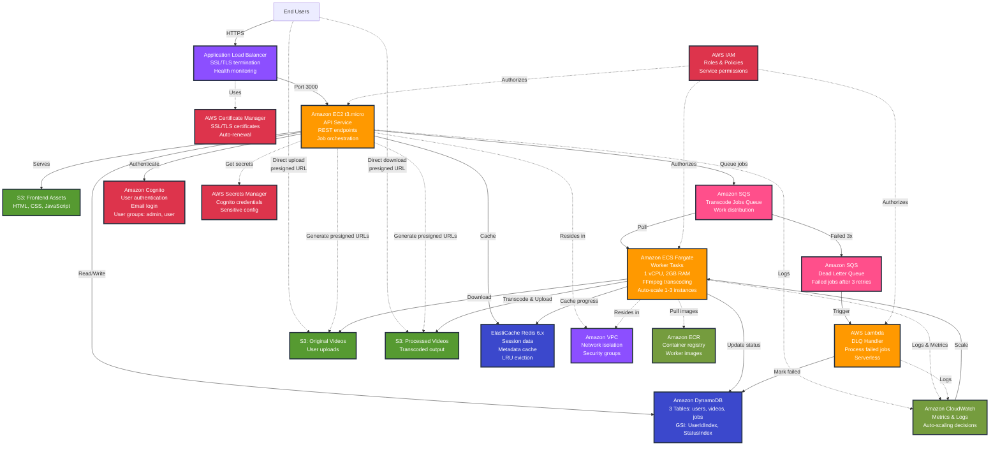

# Video Transcoding Service - Simplified Architecture Diagram

## Feature-Based Service Diagram



---

## Service Descriptions

### Compute Layer
| Service | Purpose | Configuration |
|---------|---------|---------------|
| **Amazon EC2** | API service hosting REST endpoints and job orchestration | t3.micro instance, Express.js Node.js |
| **Amazon ECS Fargate** | Serverless container platform running FFmpeg transcoding workers | 1 vCPU, 2GB RAM, auto-scale 1-3 tasks |
| **AWS Lambda** | Serverless function processing failed jobs from DLQ | Node.js 22.x, 128MB, event-driven |

### Storage Layer
| Service | Purpose | Contents |
|---------|---------|----------|
| **S3: Original Videos** | User-uploaded raw videos | Original video files, versioned, encrypted |
| **S3: Processed Videos** | Transcoded output videos | MP4/WebM files, versioned, encrypted |
| **S3: Frontend Assets** | Static website hosting | HTML, CSS, JavaScript (React app) |

### Database Layer
| Service | Purpose | Configuration |
|---------|---------|---------------|
| **Amazon DynamoDB** | NoSQL database for application data | 3 tables: users, videos, transcode-jobs<br/>GSI: UserIdIndex, StatusIndex |
| **ElastiCache Redis** | In-memory cache for sessions and metadata | Redis 6.x, LRU eviction policy |

### Integration Layer
| Service | Purpose | Configuration |
|---------|---------|---------------|
| **SQS: Transcode Jobs** | Primary work queue distributing jobs to workers | Max 3 retries, visibility timeout |
| **SQS: Dead Letter Queue** | Captures permanently failed jobs | Triggers Lambda after 3 failed retries |

### Security & Authentication
| Service | Purpose | Features |
|---------|---------|----------|
| **Amazon Cognito** | User authentication and authorization | Email login, password policies, user groups (admin, user) |
| **AWS IAM** | Service-to-service authorization | Roles for EC2, ECS tasks, Lambda with least-privilege policies |
| **AWS Secrets Manager** | Secure credential storage | Stores Cognito client secret, Redis password |
| **AWS Certificate Manager** | SSL/TLS certificate management | Auto-renewal, HTTPS encryption |

### Infrastructure & Monitoring
| Service | Purpose | Features |
|---------|---------|----------|
| **Amazon VPC** | Network isolation | Security groups, private/public subnets |
| **Amazon ECR** | Docker container registry | Stores ECS worker container images |
| **Amazon CloudWatch** | Monitoring and logging | Application logs, metrics, auto-scaling triggers |
| **Application Load Balancer** | HTTP/HTTPS load balancing | SSL termination, health checks, Layer 7 routing |

---

## Primary Data Flows

### 1. Video Upload Flow
```
User → ALB → EC2 API
         ↓
    - Authenticate (Cognito)
    - Create video record (DynamoDB)
    - Generate presigned URL (S3)
         ↓
    User → S3 Original (direct upload)
```

### 2. Transcoding Flow
```
User → ALB → EC2 API
         ↓
    - Create job (DynamoDB)
    - Queue message (SQS Main)
         ↓
    ECS Worker polls SQS
         ↓
    - Download video (S3 Original)
    - Transcode with FFmpeg
    - Upload result (S3 Processed)
    - Update job status (DynamoDB)
    - Cache progress (Redis)
         ↓
    Delete SQS message (success)
    OR
    Retry up to 3 times → DLQ → Lambda → Mark failed (DynamoDB)
```

### 3. Video Download Flow
```
User → ALB → EC2 API
         ↓
    - Get job details (DynamoDB/Redis)
    - Generate presigned URL (S3 Processed)
         ↓
    User → S3 Processed (direct download)
```

---

## Service Linkage by Feature

### Feature: User Authentication
**Services Involved:**
- Cognito (authentication)
- EC2 (API endpoints for login/register)
- IAM (EC2 role with Cognito permissions)
- Secrets Manager (Cognito client secret)

### Feature: Video Upload
**Services Involved:**
- EC2 (generate presigned POST URL)
- S3 Original (storage)
- DynamoDB (video metadata)
- IAM (EC2 role with S3/DynamoDB permissions)
- VPC (network isolation)

### Feature: Video Transcoding
**Services Involved:**
- SQS Main Queue (job distribution)
- ECS Fargate (worker tasks)
- ECR (container images)
- S3 Original (input)
- S3 Processed (output)
- DynamoDB (job tracking)
- Redis (progress caching)
- CloudWatch (worker logs, auto-scaling)
- IAM (ECS task role and execution role)
- VPC (network isolation)

### Feature: Failed Job Handling
**Services Involved:**
- SQS DLQ (failed messages)
- Lambda (event handler)
- DynamoDB (update job status)
- CloudWatch (Lambda logs)
- IAM (Lambda execution role)

### Feature: Video Download
**Services Involved:**
- EC2 (generate presigned GET URL)
- S3 Processed (storage)
- DynamoDB (job metadata)
- Redis (cache for job lookups)
- IAM (EC2 role with S3 permissions)

### Feature: SSL/TLS Security
**Services Involved:**
- ACM (certificate management)
- ALB (SSL termination)

### Feature: Monitoring & Auto-scaling
**Services Involved:**
- CloudWatch (metrics and logs)
- ECS (auto-scaling target)
- EC2 (application logs)
- Lambda (function logs)

### Feature: Network Security
**Services Involved:**
- VPC (network boundary)
- Security Groups (traffic rules)
- ALB (public entry point)
- EC2 (private instance)
- ECS (private tasks)

---

## Legend

### Arrow Types
- **Solid arrow (→)**: Primary data/control flow
- **Dashed arrow (-.->)**: Infrastructure relationship or indirect connection

### Node Colors
- **Orange**: Compute services (EC2, ECS, Lambda)
- **Green**: Storage services (S3 buckets)
- **Blue**: Database services (DynamoDB, Redis)
- **Purple**: Network services (ALB, VPC)
- **Red**: Security services (Cognito, IAM, Secrets Manager, ACM)
- **Pink**: Integration services (SQS queues)
- **Olive**: Infrastructure services (ECR, CloudWatch)

---

## Service Count Summary

| Category | Services | Count |
|----------|----------|-------|
| **Compute** | EC2, ECS Fargate, Lambda | 3 |
| **Storage** | S3 (3 buckets) | 3 |
| **Database** | DynamoDB, ElastiCache Redis | 2 |
| **Queue** | SQS (2 queues) | 2 |
| **Security/Auth** | Cognito, IAM, Secrets Manager, ACM | 4 |
| **Network** | ALB, VPC | 2 |
| **Infrastructure** | ECR, CloudWatch | 2 |
| **Total Unique Services** | | **15** |
| **Total Service Instances** | (counting 3 S3 buckets, 2 SQS queues) | **18** |

---

## Key Architectural Patterns

1. **Serverless Workers**: ECS Fargate eliminates server management for transcoding
2. **Queue-Based Decoupling**: SQS separates API from workers for scalability
3. **Direct S3 Access**: Presigned URLs bypass EC2 for uploads/downloads
4. **Caching Strategy**: Redis reduces DynamoDB reads by 60-70%
5. **Dead Letter Queue**: Lambda handles failed jobs without blocking workers
6. **Auto-scaling**: ECS scales based on CPU/memory, triggered by CloudWatch
7. **Least-Privilege IAM**: Each service has minimal required permissions
8. **Secure by Default**: VPC isolation, security groups, encryption at rest
